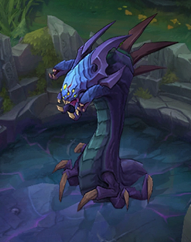
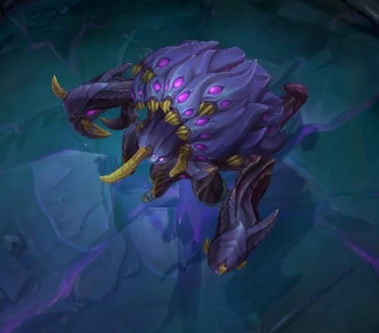
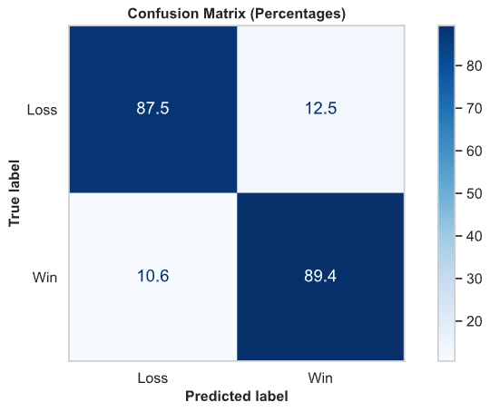
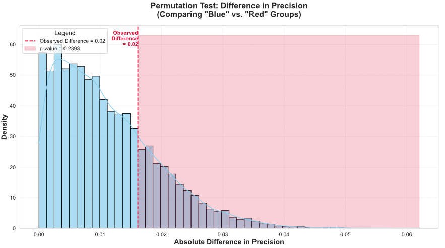

# League of Legends Predictive Analysis


*Summoner's Rift, the map the game League of legends is played on*

---
## Introduction

[League of Legends](https://en.wikipedia.org/wiki/League_of_Legends) is one of the most popular video games in the world, boasting a massive player base and a thriving, lucrative esports scene. Despite its popularity, the game is notorious for being difficult to master, largely due to the critical importance of the early game. Often regarded as the make-or-break phase where victories are decided, this stage is central to many strategies and discussions. This analysis seeks to uncover whether the early game’s importance is a myth perpetuated by the community or a genuine predictor of match outcomes


*The crowd of the [2024 League of Legends World Championship, London](https://en.wikipedia.org/wiki/2024_League_of_Legends_World_Championship_final)*

**This report** aims to cut through anecdotal claims and rigorously examine whether strong early-game performance genuinely correlates with eventual victory. Is the emphasis on first objectives, early gold leads, and timely experience advantages truly justified? Or are these narratives perpetuated myths? By analyzing professional match data, we seek to clarify the extent to which early dominance predicts a team’s success.

**Dataset Source:** Our analysis draws from a dataset provided by [Oracle’s Elixir](https://oracleselixir.com/tools/downloads), encompassing approximately 10,000 professional-level esports matches from top-tier leagues such as the LCS, LEC, LCK, and LPL.  

**Central Question:** Do early-game objectives—like securing the first dragon or herald—and establishing resource leads in factors like gold and experience reliably translate into a higher likelihood of winning the match?

**Why It Matters:** Understanding the importance of the early game goes beyond theorycrafting. It informs coaching decisions, enhances commentators’ insights, guides viewers in predicting outcomes during live matches, and even helps regular players refine their strategies.

---
### Context

For those who are unfamiliar with League of Legends, you'll need to know *some* things about the game for the following analysis.

#### What is League of Legends?

League of Legends is an online video game, particularly a MOBA (multiplayer online battle arena). The game concists of 2 teams of 5 "champions" each with their unique skill set. The goal for each team is to eventually raid and destroy the oposing team's "Nexus" which is essentially their home-base. This is usually done by killing the enemy team's champions,

#### What are Objectives?

In a League of Legends match, objectives are key strategic goals that contribute to a team's strength and progression toward victory. These objectives not only give advantages like gold, experience, or buffs but also create opportunities to push toward the enemy base. Below are the primary objectives players prioritize during a match:

- **Turrets**: Defensive structures that protect the lanes leading to the enemy Nexus. Destroying these grants gold and opens pathways for further advancement.
<iframe
  src="turret.png"
  width="1200"
  height="600"
  frameborder="0"
></iframe>
- **Dragons**: Powerful neutral monsters that provide team-wide buffs when defeated. There are several types of elemental dragons, each offering unique bonuses. Securing four dragons unlocks the powerful Dragon Soul.

- **Baron Nashor**: The most powerful neutral monster, granting a significant team-wide buff that enhances minion strength and helps with sieging enemy bases.

- **Rift Herald**: A neutral monster that, once defeated, drops a buff allowing the summoning of a creature capable of dealing massive damage to enemy turrets.


#### What is Gold, CS, and Experience?

- **Gold** is the currency used to purchase items in League of Legends to make your champion stronger. You can earn gold by killing enemies, completing objectives, and killing minions (non-playable small monsters).  
- **XP** (or experience points) are used to level up your champion, making them more powerful. Experience points are gained in the same ways as gold.  
- **CS** (or creep score) refers to the number of minions and other monsters you have killed. It is an important metric for measuring farming efficiency.

 This analysis dives deeper into how teams approach these objectives, the data trends around them, and their overall impact on a match’s outcome.

---

### Dataset Overview

To provide a clearer picture, here is an overview of our cleaned data and the key columns we’ll be examining and using for prediction.

| side   |   total_counters |   avg_pick_win_pct | firstblood   | firstdragon   | firstherald   | firstbaron   | firsttower   | firstmidtower   | firsttothreetowers   |   goldat15 |   xpat15 |   csat15 |   golddiffat15 |   xpdiffat15 |   csdiffat15 |   killsat15 |   assistsat15 |   deathsat15 |   Win |
|:-------|-----------------:|-------------------:|:-------------|:--------------|:--------------|:-------------|:-------------|:----------------|:---------------------|-----------:|---------:|---------:|---------------:|-------------:|-------------:|------------:|--------------:|-------------:|------:|
| Blue   |                1 |           0.486409 | False        | False         | True          | True         | True         | True            | True                 |      22384 |    29220 |      498 |           -530 |        -1671 |          -37 |           0 |             0 |            1 |     1 |
| Red    |                0 |           0.474672 | True         | True          | False         | False        | False        | False           | False                |      22914 |    30891 |      535 |            530 |         1671 |           37 |           1 |             1 |            0 |     0 |
| Blue   |                2 |           0.466322 | False        | False         | True          | True         | False        | True            | True                 |      24771 |    30084 |      498 |            673 |          530 |          -34 |           4 |             6 |            3 |     0 |
| Red    |                1 |           0.514853 | True         | True          | False         | False        | True         | False           | False                |      24098 |    29554 |      532 |           -673 |         -530 |           34 |           3 |             4 |            4 |     1 |
| Blue   |                0 |           0.480499 | False        | False         | False         | False        | False        | True            | False                |      22945 |    27423 |      510 |          -1901 |         -763 |           58 |           2 |             1 |            4 |     1 |

- **Number of Rows:** 21,946 (each match contributes two rows—one for each team)
- **Key Columns:**  
  - **side:** Red or Blue, indicating the team’s starting side.  
  - **total_counters:** The number of counter-picks the opposing team fields, where a counter-pick is a champion selection that outperforms one chosen by the first team. 
  - **avg_pick_win_pct:** The average of all the win percentages of every champion on the selected team
  - **firstblood:** Binary indicator of whether the team secured the first kill of the match.  
  - **firstdragon:** Binary indicator of securing the first dragon.  
  - **firstherald:** Binary indicator of securing the first herald.  
  - **firstbaron:** Binary indicator of securing the first baron.  
  - **firsttower:** Binary indicator of taking down the first tower.  
  - **firsttothreetowers:** Binary indicator of being the first to destroy three towers.  
  - **goldat15:** Numerical value representing the team’s total gold at 15 minutes.  
  - **xpat15:** Numerical value representing the team’s total experience at 15 minutes.  
  - **csat15:** Numerical value representing the team’s total creep score at 15 minutes.  
  - **killsat15:** Numerical value representing the team’s total kills at 15 minutes.  
  - **assistsat15:** Numerical value representing the team’s total assists at 15 minutes.  
  - **deathsat15:** Numerical value representing the team’s total deaths at 15 minutes.
  - **golddiffat15:** Numerical value indicating the gold lead or deficit compared to the opponent at 15 minutes.  
  - **xpdiffat15:** Numerical value indicating the experience lead or deficit at 15 minutes.  
  - **csdiffat15:** Numerical value indicating the creep score lead or deficit at 15 minutes.  
  - **Win:** Binary indicator of whether the team won or lost.  

#### However, the data was not always this clean. Lets take a look at the data cleaning process.
---

## Data Cleaning and Exploratory Data Analysis


### Cleaning Steps

1. **Handling Incorrecnt Data Types:** Binary columns, like **firstblood**, **firsttower**, etc., were not boolean values, so these columns were transformed into boolean values. Dates, like the **date** column was not a datetime object, so they also needed to be converted. 
2. **Transforming Columns:** Columns like **participantid** had redundant information before the key information, like the id. The strings in these columsn were changed to only include important information.
3. **Dropping Player Columns:** The original dataset had 12 entries for each game, as it also captured data for all 10 players in the game. Those columns were not needed in this analysis, since we are looking at team data, so they were dropped 
4. **Dropping Irrelevant Columns:** Columns concerning things that were not in patch 13, like void grubs, were dropped.

### Column Creation

New, relevant columns were then created and added to the data.

- **KDA:** This column has the kill death assist ratio for a team which is calculated as $\frac{kills + assists}{deaths}$
- **Total Objectives:** This column has the total number of objectives the team does in the game, combining columns concerning towers, dragonds, etc. 
- **Region:** This column has region of each league. This was done by creating a dictionary mapping of leagues to their ISO-3 country code which will be important later on.
- **Total Counters / Counter Pick Data:** These columns were created by using [this JSON mapping](https://github.com/Marwan01/LoL-champ-select/blob/master/src/assets/data.json). If a pick on a team is "countered" by a pick on the other team, a columns pickx_countered is changed from 0 to 1. Then, the teams total counter picks are summed up. 
- **Win Percentage Data:** For each champion a team selected, the data is searched for that champions win rate percentage which is defined as $\frac{numebr of games where champ is picked and wins}{number of games where champ is picked}$. These columns are then created as pickx_win_pct

### Full Final Cleaned table:  

 | gameid                | datacompleteness   |   url | league   |   year | split   | playoffs   | date                |   game |   patch |   team | side   | position   | teamname      | teamid                          | ban1         | ban2    | ban3    | ban4      | ban5   | pick1   | pick2   | pick3   | pick4        | pick5   |   gamelength | result   |   kills |   deaths |   assists |   doublekills |   triplekills |   quadrakills |   pentakills | firstblood   |   team kpm |   ckpm | firstdragon   |   dragons |   opp_dragons |   elementaldrakes |   opp_elementaldrakes |   infernals |   mountains |   clouds |   oceans |   chemtechs |   hextechs |   dragons (type unknown) |   elders |   opp_elders | firstherald   |   heralds |   opp_heralds | firstbaron   |   barons |   opp_barons | firsttower   |   towers |   opp_towers | firstmidtower   | firsttothreetowers   |   turretplates |   opp_turretplates |   inhibitors |   opp_inhibitors |   damagetochampions |     dpm |   damagetakenperminute |   damagemitigatedperminute |   wardsplaced |    wpm |   wardskilled |   wcpm |   controlwardsbought |   visionscore |   vspm |   totalgold |   earnedgold |   earned gpm |   goldspent |       gspd |   gpr |   minionkills |   monsterkills |   monsterkillsownjungle |   monsterkillsenemyjungle |    cspm |   goldat10 |   xpat10 |   csat10 |   opp_goldat10 |   opp_xpat10 |   opp_csat10 |   golddiffat10 |   xpdiffat10 |   csdiffat10 |   killsat10 |   assistsat10 |   deathsat10 |   opp_killsat10 |   opp_assistsat10 |   opp_deathsat10 |   goldat15 |   xpat15 |   csat15 |   opp_goldat15 |   opp_xpat15 |   opp_csat15 |   golddiffat15 |   xpdiffat15 |   csdiffat15 |   killsat15 |   assistsat15 |   deathsat15 |   opp_killsat15 |   opp_assistsat15 |   opp_deathsat15 |   goldat20 |   xpat20 |   csat20 |   opp_goldat20 |   opp_xpat20 |   opp_csat20 |   golddiffat20 |   xpdiffat20 |   csdiffat20 |   killsat20 |   assistsat20 |   deathsat20 |   opp_killsat20 |   opp_assistsat20 |   opp_deathsat20 |   goldat25 |   xpat25 |   csat25 |   opp_goldat25 |   opp_xpat25 |   opp_csat25 |   golddiffat25 |   xpdiffat25 |   csdiffat25 |   killsat25 |   assistsat25 |   deathsat25 |   opp_killsat25 |   opp_assistsat25 |   opp_deathsat25 |     KDA |   total_objectives | region   | pick1_countered   | pick2_countered   | pick3_countered   | pick4_countered   | pick5_countered   |   total_counters | Game Result   |   Win |   pick1_win_pct |   pick2_win_pct |   pick3_win_pct |   pick4_win_pct |   pick5_win_pct |
|:----------------------|:-------------------|------:|:---------|-------:|:--------|:-----------|:--------------------|-------:|--------:|-------:|:-------|:-----------|:--------------|:--------------------------------|:-------------|:--------|:--------|:----------|:-------|:--------|:--------|:--------|:-------------|:--------|-------------:|:---------|--------:|---------:|----------:|--------------:|--------------:|--------------:|-------------:|:-------------|-----------:|-------:|:--------------|----------:|--------------:|------------------:|----------------------:|------------:|------------:|---------:|---------:|------------:|-----------:|-------------------------:|---------:|-------------:|:--------------|----------:|--------------:|:-------------|---------:|-------------:|:-------------|---------:|-------------:|:----------------|:---------------------|---------------:|-------------------:|-------------:|-----------------:|--------------------:|--------:|-----------------------:|---------------------------:|--------------:|-------:|--------------:|-------:|---------------------:|--------------:|-------:|------------:|-------------:|-------------:|------------:|-----------:|------:|--------------:|---------------:|------------------------:|--------------------------:|--------:|-----------:|---------:|---------:|---------------:|-------------:|-------------:|---------------:|-------------:|-------------:|------------:|--------------:|-------------:|----------------:|------------------:|-----------------:|-----------:|---------:|---------:|---------------:|-------------:|-------------:|---------------:|-------------:|-------------:|------------:|--------------:|-------------:|----------------:|------------------:|-----------------:|-----------:|---------:|---------:|---------------:|-------------:|-------------:|---------------:|-------------:|-------------:|------------:|--------------:|-------------:|----------------:|------------------:|-----------------:|-----------:|---------:|---------:|---------------:|-------------:|-------------:|---------------:|-------------:|-------------:|------------:|--------------:|-------------:|----------------:|------------------:|-----------------:|--------:|-------------------:|:---------|:------------------|:------------------|:------------------|:------------------|:------------------|-----------------:|:--------------|------:|----------------:|----------------:|----------------:|----------------:|----------------:|
| ESPORTSTMNT06_2753012 | complete           |   nan | LFL2     |   2023 | Spring  | False      | 2023-01-10 17:07:16 |      1 |   13.01 |      1 | Blue   | team       | Klanik Esport | 0ade5e44c23039bca133eee58ec1b83 | Sylas        | Caitlyn | Wukong  | Akali     | Yone   | Karma   | Ezreal  | Poppy   | Jax          | Taliyah |         2612 | True     |      13 |        7 |        38 |             1 |             1 |             0 |            0 | False        |     0.2986 | 0.4594 | False         |         4 |             3 |                 4 |                     3 |           0 |           0 |        0 |        4 |           0 |          0 |                      nan |        0 |            0 | True          |         2 |             0 | True         |        1 |            0 | True         |       11 |            2 | True            | True                 |              4 |                  2 |            2 |                0 |               95203 | 2186.9  |                2690.93 |                    3235.13 |           130 | 2.9862 |            40 | 0.9188 |                   55 |           312 | 7.1669 |       72807 |        44787 |     1028.8   |       65505 |  0.0706496 |  1.02 |          1039 |            247 |                       0 |                         0 | 29.5406 |      14612 |    18745 |      317 |          14537 |        18901 |          328 |             75 |         -156 |          -11 |           0 |             0 |            0 |               0 |                 0 |                0 |      22384 |    29220 |      498 |          22914 |        30891 |          535 |           -530 |        -1671 |          -37 |           0 |             0 |            1 |               1 |                 1 |                0 |      31204 |    40275 |      679 |          30458 |        41568 |          711 |            746 |        -1293 |          -32 |           0 |             0 |            1 |               1 |                 1 |                0 |      39022 |    49317 |      830 |          37484 |        50343 |          853 |           1538 |        -1026 |          -23 |           0 |             0 |            2 |               2 |                 5 |                0 | 7.28571 |                 18 | FRA      | False             | False             | False             | False             | True              |                1 | Win           |     1 |        0.41847  |        0.443983 |        0.521385 |        0.521965 |        0.526239 |
| ESPORTSTMNT06_2753012 | complete           |   nan | LFL2     |   2023 | Spring  | False      | 2023-01-10 17:07:16 |      1 |   13.01 |      2 | Red    | team       | MS Company    | 14ad76b8d9e647d4b29c3d26ecd29c9 | Galio        | Lucian  | Fiora   | Viktor    | Azir   | Yuumi   | Sejuani | Zeri    | Syndra       | Viego   |         2612 | False    |       7 |       13 |        18 |             1 |             0 |             0 |            0 | True         |     0.1608 | 0.4594 | True          |         3 |             4 |                 3 |                     4 |           1 |           0 |        0 |        1 |           0 |          1 |                      nan |        0 |            0 | False         |         0 |             2 | False        |        0 |            1 | False        |        2 |           11 | False           | False                |              2 |                  4 |            0 |                2 |               85333 | 1960.18 |                2864.1  |                    3425.05 |            80 | 1.8377 |            49 | 1.1256 |                   20 |           304 | 6.9832 |       62745 |        34725 |      797.665 |       61035 | -0.0706496 | -1.02 |          1008 |            218 |                       0 |                         0 | 28.1623 |      14537 |    18901 |      328 |          14612 |        18745 |          317 |            -75 |          156 |           11 |           0 |             0 |            0 |               0 |                 0 |                0 |      22914 |    30891 |      535 |          22384 |        29220 |          498 |            530 |         1671 |           37 |           1 |             1 |            0 |               0 |                 0 |                1 |      30458 |    41568 |      711 |          31204 |        40275 |          679 |           -746 |         1293 |           32 |           1 |             1 |            0 |               0 |                 0 |                1 |      37484 |    50343 |      853 |          39022 |        49317 |          830 |          -1538 |         1026 |           23 |           2 |             5 |            0 |               0 |                 0 |                2 | 1.92308 |                  5 | FRA      | <NA>              | False             | <NA>              | False             | <NA>              |                0 | Loss          |     0 |        0.463717 |        0.488243 |        0.485057 |        0.459903 |        0.47644  |
| ESPORTSTMNT06_2754023 | complete           |   nan | LFL2     |   2023 | Spring  | False      | 2023-01-10 18:15:01 |      1 |   13.01 |      1 | Blue   | team       | beGenius ESC  | 607baf04091e515e195644cb08ec21c | Fiora        | Kindred | Sejuani | Nautilus  | Leona  | Nami    | Lucian  | K'Sante | Xin Zhao     | Ryze    |         2436 | False    |      20 |       16 |        44 |             2 |             0 |             0 |            0 | False        |     0.4926 | 0.8867 | False         |         3 |             4 |                 2 |                     4 |           0 |           1 |        0 |        0 |           0 |          1 |                      nan |        1 |            0 | True          |         2 |             0 | True         |        2 |            1 | False        |        5 |           11 | True            | True                 |              6 |                  2 |            0 |                3 |              106526 | 2623.79 |                2675.74 |                    3482.36 |           119 | 2.931  |            55 | 1.3547 |                   49 |           298 | 7.3399 |       80627 |        54402 |     1339.95  |       74800 |  0.0223048 | -0.15 |          1111 |            225 |                       0 |                         0 | 32.9064 |      15969 |    19120 |      324 |          16330 |        18838 |          346 |           -361 |          282 |          -22 |           2 |             2 |            2 |               2 |                 3 |                2 |      24771 |    30084 |      498 |          24098 |        29554 |          532 |            673 |          530 |          -34 |           4 |             6 |            3 |               3 |                 4 |                4 |      33762 |    41947 |      665 |          34810 |        41087 |          697 |          -1048 |          860 |          -32 |           8 |            15 |            6 |               6 |                11 |                8 |      46371 |    59276 |      814 |          43663 |        52556 |          867 |           2708 |         6720 |          -53 |          13 |            27 |            9 |               9 |                19 |               13 | 4       |                 12 | FRA      | False             | True              | <NA>              | <NA>              | True              |                2 | Loss          |     0 |        0.485601 |        0.500871 |        0.467915 |        0.365759 |        0.511464 |
| ESPORTSTMNT06_2754023 | complete           |   nan | LFL2     |   2023 | Spring  | False      | 2023-01-10 18:15:01 |      1 |   13.01 |      2 | Red    | team       | ViV Esport    | 2d9e95ecefb34c32ff1a997ebe372f9 | Heimerdinger | Wukong  | Akali   | Syndra    | Sylas  | Draven  | Vi      | Gwen    | Amumu        | Irelia  |         2436 | True     |      16 |       20 |        28 |             1 |             0 |             0 |            0 | True         |     0.3941 | 0.8867 | True          |         4 |             3 |                 4 |                     2 |           0 |           0 |        0 |        0 |           1 |          3 |                      nan |        0 |            1 | False         |         0 |             2 | False        |        1 |            2 | True         |       11 |            5 | False           | False                |              2 |                  6 |            3 |                0 |               80368 | 1979.51 |                3522.34 |                    4410.91 |           119 | 2.931  |            53 | 1.3054 |                   40 |           330 | 8.1281 |       77449 |        51224 |     1261.67  |       73150 | -0.0223048 |  0.15 |          1102 |            261 |                       0 |                         0 | 33.5714 |      16330 |    18838 |      346 |          15969 |        19120 |          324 |            361 |         -282 |           22 |           2 |             3 |            2 |               2 |                 2 |                2 |      24098 |    29554 |      532 |          24771 |        30084 |          498 |           -673 |         -530 |           34 |           3 |             4 |            4 |               4 |                 6 |                3 |      34810 |    41087 |      697 |          33762 |        41947 |          665 |           1048 |         -860 |           32 |           6 |            11 |            8 |               8 |                15 |                6 |      43663 |    52556 |      867 |          46371 |        59276 |          814 |          -2708 |        -6720 |           53 |           9 |            19 |           13 |              13 |                27 |                9 | 2.2     |                 16 | FRA      | True              | False             | <NA>              | False             | False             |                1 | Win           |     1 |        0.492958 |        0.527586 |        0.483283 |        0.560538 |        0.509901 |
| ESPORTSTMNT06_2755035 | complete           |   nan | LFL2     |   2023 | Spring  | False      | 2023-01-10 19:20:51 |      1 |   13.01 |      1 | Blue   | team       | Team du Sud   | 1dc6411295a36bd29c29b1096ba859d | Zac          | Sylas   | Sejuani | Jarvan IV | Ornn   | Varus   | Wukong  | Syndra  | Renata Glasc | Aatrox  |         1980 | True     |      20 |        7 |        48 |             2 |             2 |             0 |            0 | False        |     0.6061 | 0.8182 | False         |         4 |             1 |                 4 |                     1 |           1 |           0 |        0 |        0 |           0 |          3 |                      nan |        0 |            0 | False         |         0 |             2 | False        |        0 |            1 | False        |        7 |            4 | True            | False                |              3 |                  6 |            1 |                0 |               64962 | 1968.55 |                2451.61 |                    2418.33 |           106 | 3.2121 |            50 | 1.5152 |                   42 |           292 | 8.8485 |       60938 |        39364 |     1192.85  |       51975 | -0.0185847 | -0.15 |           876 |            231 |                       0 |                         0 | 33.5455 |      14794 |    17060 |      326 |          15795 |        18808 |          304 |          -1001 |        -1748 |           22 |           1 |             0 |            2 |               2 |                 2 |                1 |      22945 |    27423 |      510 |          24846 |        28186 |          452 |          -1901 |         -763 |           58 |           2 |             1 |            4 |               4 |                 6 |                2 |      33825 |    39638 |      661 |          34180 |        38502 |          593 |           -355 |         1136 |           68 |           8 |            17 |            7 |               7 |                10 |                8 |      42236 |    50997 |      849 |          41014 |        47970 |          753 |           1222 |         3027 |           96 |           9 |            18 |            7 |               7 |                10 |                9 | 9.71429 |                 11 | FRA      | False             | False             | False             | <NA>              | False             |                0 | Win           |     1 |        0.478385 |        0.454957 |        0.459903 |        0.535797 |        0.473451 |


### Impact on Analysis

These steps were very important because they allowed for more complex future analysis. By fixing the columns and adding more info with other columns, we can now make a more sophisticated analysis that brings in more factors.

---

## Exploratory Visualizations

### Univariate Analysis

<iframe
  src="uni1.html"
  width="1200"
  height="600"
  frameborder="0"
></iframe>

This graph represents the distribution of total gold earned in League of Legends, showing a near-normal distribution with a mean of $56,758 and a median of $56,311. Most teams in this dataset earn gold within this range, while the 5th and 95th percentiles highlight outliers, indicating underperformance or dominant gameplay from teams.


<iframe
  src="uni2.html"
  width="1200"
  height="600"
  frameborder="0"
></iframe>

This map illustrates the global distribution of League of Legends matches by country, with the highest concentration in countries like China, the United States, and South Korea. The darker shades indicate more matches played, showcasing regions with stronger player bases or higher activity levels. This trend may also be seen in the league of legends player base as there may be more players where more esports matches are occuring. 


---

### Bivariate Analysis

<iframe
  src="bi1.html"
  width="1200"
  height="600"
  frameborder="0"
></iframe>

This box plot shows that teams with a positive gold difference of around 1,510 at 15 minutes are more likely to win, while teams with a negative gold difference of around -1,510 tend to lose. The clear separation of medians highlights the strong correlation between early gold leads and game outcomes in League of Legends 


<iframe
  src="bi2.html"
  width="1200"
  height="600"
  frameborder="0"
></iframe>

This plot shows the relationship between the number of total objectives secured and the win rate in a game, with a clear upward trend. The threshold of 11 objectives marks the point where teams achieve at least a 50% win rate, emphasizing the importance of securing objectives for victory.

---
### Interesting Aggregates

| region   |   Total_Matches |   Average_Team_KDA |   Average_Game_Length_Minutes |   Average_CSPM |
|:---------|----------------:|-------------------:|------------------------------:|---------------:|
| CHN      |            3456 |            6.05982 |                       30.7834 |       nan      |
| USA      |            2258 |            5.66261 |                       31.1989 |        31.6886 |
| KOR      |            1960 |            6.35519 |                       31.8024 |        33.4114 |
| DEU      |            1876 |            5.64487 |                       31.5424 |        32.2868 |
| ESP      |            1460 |            5.32136 |                       31.7064 |        31.1632 |

This table highlights the regions with the most League of Legends matches, sorted by total matches played, with China (CHN) leading at 3,456 matches. South Korea (KOR) stands out with the highest Average Team KDA (6.36) and Average CSPM (33.41), indicating highly efficient gameplay, while the USA has slightly longer game lengths, suggesting varied strategies or playstyles.

|   patch |   Total_Matches |   Average_Total_Gold |
|--------:|----------------:|---------------------:|
|   13.01 |            3684 |              57019.8 |
|   13.13 |            2234 |              57323.9 |
|   13.11 |            2084 |              55376.6 |
|   13.04 |            2020 |              56361.4 |
|   13.12 |            1844 |              56829   |

This table shows the number of matches and average total gold for different patches, with Patch 13.01 having the highest number of matches (3,684) but a slightly lower average total gold (57,019.8) compared to patches like 13.13 (57,323.9). The variation in total gold across patches could indicate adjustments in game balance or changes in meta strategies affecting gold generation.

| teamname        |   Games Played |   Wins |   Win Rate (%) |   Avg KDA |   Avg GPM |   Avg DPM |   Avg Vision Score per Minute |   Avg Dragons Taken |   Avg Barons Taken |   Avg Towers Taken |
|:----------------|---------------:|-------:|---------------:|----------:|----------:|----------:|------------------------------:|--------------------:|-------------------:|-------------------:|
| Bilibili Gaming |            164 |    103 |          62.8  |      6.59 |   1240.2  |   2328.93 |                          8.66 |                2.45 |               0.88 |               6.98 |
| T1              |            152 |     96 |          63.16 |      6.93 |   1212.25 |   2200.14 |                          8.58 |                2.56 |               0.88 |               7.09 |
| JD Gaming       |            125 |     95 |          76    |      8.07 |   1281.8  |   2397.54 |                          8.73 |                2.47 |               0.82 |               7.5  |
| Gen.G           |            133 |     95 |          71.43 |      9.13 |   1257.64 |   2215.19 |                          9.09 |                2.56 |               0.89 |               7.42 |
| KT Rolster      |            130 |     88 |          67.69 |      9.7  |   1214.83 |   2022.09 |                          8.69 |                2.6  |               0.81 |               7.04 |

This table highlights team performance based on wins, with JD Gaming achieving the highest win rate (76%) and impressive stats such as the highest Avg GPM (1281.8) and Avg DPM (2397.54), showcasing exceptional gameplay efficiency. Teams like Gen.G and KT Rolster also stand out with high win rates and exceptional KDAs, emphasizing their strong team coordination and map control

---
## Assessment of Missingness

**NMAR Analysis:** I believe that the column `url` is potentially NMAR because less important matches or matches with less views might not have a dedicated url. This could mean that more popular leagues could have more urls than less popular leagues. Furthermore, if a game is a playoff game, it might have more views and subsequently, a url.

### Missingness Dependency

First, we want to test if the url column is dependent on the league column. To do so, we will run a (permuation test)[https://en.wikipedia.org/wiki/Permutation_test]. 
Our hypotheses and test statstics are the following:

- Null Hypothesis: the URL column's missingness is independent on the league column

- Alternate Hypothesis: the URL column's missingness is dependent on the league column

- Test Statistic: Total Variation Distance

- Confidence Level: 0.01

<iframe
  src="missing1.html"
  width="1200"
  height="600"
  frameborder="0"
></iframe>

The p-value of this hypothesis test was ~0.0, signifying that the observed TVD is very likley not due to chance. This means we reject the null hypothesis and 
url's missingness is likley dependent on league. This tells us that **url is MAR on league**.
---

Now, we want to test if the url column is dependent on the playoff column. Our hypotheses and test statstics are the following: 

- Null Hypothesis: the URL column's missingness is independent on the playoff column

- Alternate Hypothesis: the URL column's missingness is dependent on the playoff column

- Test Statistic: Total Variation Distance

- Confidence Level: 0.01

<iframe
  src="missing2.html"
  width="1200"
  height="600"
  frameborder="0"
></iframe>

The p-value of this hypothesis test was ~0.0, signifying that the observed TVD is very likley not due to chance. This means we reject the null hypothesis and 
url's missingness is likley dependent on playoff. This tells us that **url is MAR on playoff**.

---
Now, we want to test if the url column is dependent on the barons column. Our hypotheses and test statstics are the following: 

- Null Hypothesis: the URL column's missingness is independent on the barons column

- Alternate Hypothesis: the URL column's missingness is dependent on the barons column

- Test Statistic: Difference of Means

- Confidence Level: 0.01

<iframe
  src="missing3.html"
  width="1200"
  height="600"
  frameborder="0"
></iframe>

The p-value of this hypothesis test was ~0.019, signifying that the observed difference in means very likley due to chance. This means we fail to reject the null hypothesis and 
url's missingness is likley not dependent on barons. This tells us that **url is not MAR on barons**.

---

## Hypothesis Testing

Another early-game indicator of who will end up winning the game is the amount of kills at 10 minutes into the game. Here, we will run a permutation test to see if the amount of kills a team has 10 minutes into the game has a relationship with victory. 

### Test Results

- Null Hypothesis: a higher teamkillsat10 has no relationship with the game outcome. The mean teamkillsat10 for winning teams is not higher to that of losing teams.

- Alternate Hypothesis: a higher teamkillsat10 suggests a higher chance of winning. The mean teamkillsat10 for winning teams is higher that of losing teams.


- Test Statistic: Difference of Means

- Confidence Level: 0.01

<iframe
  src="hypoth.html"
  width="1200"
  height="600"
  frameborder="0"
></iframe>

**Conclusion:** The p-value of this hypothesis test was ~0.0. This means that the difference in means between winning teams and losing teams was very likley not due to chance. This means we reject the null hypothesis. This hypothesis test leads us to believe that teamkillsat10 can be used as a good predictor of vicotry, we will use this in our prediction process 

---

## Framing a Prediction Problem

The goal of this analysis is to develop a robust classifier capable of predicting the outcome of a League of Legends match (Win/Loss). The model will be trained using early-game metrics and champion selection data, allowing it to deliver predictions based on the state of the game after the early phase has concluded.

By focusing on early-game performance indicators, this approach serves a dual purpose:

Outcome Prediction: Providing a reliable estimate of the winning team once the early game concludes.

Feature Importance Analysis: Quantifying the influence of early-game metrics on the overall outcome, shedding light on their significance within professional-level matches.

These features will be those we discussed above, like counter picks, champion win rates, goldat15, csat15, etc.

Why the 15-Minute Mark?

Importantly, we define the early game as the period ending at the 15-minute mark. This is a pivotal time in professional League of Legends, as teams are permitted to forfeit starting at this point. By using this benchmark, the model’s predictions can serve an additional, practical purpose: guiding teams in deciding whether to continue fighting or concede the game. This makes the model not only a tool for analysis but also a potential decision-support system in live scenarios.

By the end of this process, we aim to uncover not just who is likely to win, but why—deepening our understanding of the early game’s true role in determining match outcomes.


---

## Baseline Model

### Model Description
For our initial baseline model, we have employed a **Logistic Regression** classifier. This choice is motivated by logistic regression’s interpretability and its effectiveness in binary classification tasks. The model is implemented within a scikit-learn **Pipeline** that includes feature preprocessing steps before passing the transformed features into the logistic regression estimator.

### Features and Their Types
Our dataset includes the following features:

1. **side** (Nominal, categorical): Represents which side (e.g., blue or red) the team is on.
2. **firsttower** (Boolean, treated as nominal): Indicates whether the team secured the first tower kill.
3. **firsttothreetowers** (Boolean, treated as nominal): Indicates whether the team was the first to destroy three towers.
4. **goldat15** (Quantitative): The team’s gold amount at the 15-minute mark.
5. **xpat15** (Quantitative): The team’s experience (XP) at the 15-minute mark.

**Count by Type:**
- **Nominal (including Boolean):** 3 features  
   - side (categorical, encoded using OneHotEncoder)
   - firsttower (boolean, converted to int)
   - firsttothreetowers (boolean, converted to int)
- **Quantitative:** 2 features  
   - goldat15
   - xpat15

### Preprocessing and Encodings
- **Nominal Categorical Feature (side):** Encoded using a **OneHotEncoder**, which creates separate binary columns for each category. One category is dropped to avoid the dummy variable trap.
- **Boolean Features (firsttower, firsttothreetowers):** Converted to integer values (0 and 1) using a simple function transformer.
- **Quantitative Features (goldat15, xpat15):** Standardized using **StandardScaler** to ensure all features contribute equally to the model without being dominated by larger numerical ranges.

All these steps are combined into a single preprocessing pipeline using a **ColumnTransformer**, which is then chained with the Logistic Regression model through a **Pipeline**. This ensures that all preprocessing is consistently and automatically applied to both training and testing data.

### Model Performance
The model’s performance on the test set is as follows:
- **Accuracy:** 0.8153 (approximately)
- **Recall:** 0.8126 (approximately)
- **Precision:** 0.8189 (approximately)

These metrics suggest that the model is performing reasonably well. It correctly classifies around 81.5% of the test cases. The recall and precision values are both above 0.8, indicating a good balance between identifying positive cases and not over-predicting them.

### Is the Model “Good”?
While the results are promising for a baseline, calling the model “good” depends on the context and the performance expectations for the given task. An accuracy of around 81% might be considered solid, especially if the baseline or naive methods perform significantly worse. However, there is likely room for improvement.

In summary, the model offers a strong starting point with clear room for future refinements.  


---

## Final Model

## Preprocessing and Feature Engineering

### Rationale and Overall Strategy
Before training our final model, it is essential to carefully preprocess our data to ensure that all features are presented to the model in an optimal form. The main goals of our preprocessing and feature engineering steps are to:

1. **Handle and Enhance Features**: Move beyond raw features to derive more meaningful, engineered features that may capture important underlying relationships in the data.
2. **Normalize and Transform Data**: Apply transformations to numerical features to ensure they are on comparable scales and distributions, mitigating the impact of outliers and skewed distributions.
3. **Encode Categorical and Boolean Variables**: Convert categorical and boolean variables into numeric encodings suitable for model training, avoiding the pitfalls of ordinal assumptions and ensuring the model can leverage categorical distinctions.

### Feature Engineering Steps
We begin by applying a custom feature engineering function:

- **`kda_at_15`**: This feature represents the KDA (Kills-Deaths-Assists) ratio at the 15-minute mark. Specifically, it is defined as:
  \[
  \text{kda\_at\_15} = \frac{\text{killsat15} + \text{assistsat15}}{\max(\text{deathsat15}, 1)}
  \]
  Using a maximum of 1 for deaths ensures we never divide by zero. By engineering this feature, we combine kills, assists, and deaths into a single metric that captures a team’s early combat effectiveness.

- **`gold_xp_ratio_at_15`**: We create a ratio of gold to experience at 15 minutes:
  \[
  \text{gold\_xp\_ratio\_at\_15} = \frac{\text{goldat15}}{\max(\text{xpat15}, 1)}
  \]
  This ratio highlights how effectively the team is translating early game presence into both gold and experience advantages, which are crucial for snowballing leads.

- **`num_first_objectives`**: We sum across multiple binary indicators of achieving the first key objectives (first blood, first dragon, first herald, first baron, first tower, first mid tower, first to three towers). By aggregating these into a single numeric value, we quantify early objective dominance in a simple metric:
  \[
  \text{num\_first\_objectives} = \sum_{\text{obj} \in \{\text{firstblood}, \ldots\}} \mathbf{1}_{\text{obj}}
  \]

- **`combined_diff_at_15`**: We combine gold, XP, and CS differences at 15 minutes into one feature:
  \[
  \text{combined\_diff\_at\_15} = \text{golddiffat15} + \text{xpdiffat15} + \text{csdiffat15}
  \]
  This feature captures a broader sense of early advantage by combining multiple performance indicators into a single metric.

- **`win_pct_deviation`**: By taking the average pick win percentage (e.g., the historical performance of the chosen composition) and subtracting 0.5, we measure how much better or worse the team’s average pick win rate is than a coin flip:
  \[
  \text{win\_pct\_deviation} = \text{avg\_pick\_win\_pct} - 0.5
  \]

These engineered features are intended to create more informative representations of early-game performance and team composition strength.

### Data Transformation Decisions

#### 1. Categorical Encoding
- **Categorical Columns**: For categorical features like `side`, we use a **OneHotEncoder**. This ensures that the model does not assume any ordinal relationship between categories (e.g., "blue" is not inherently greater than "red"). Dropping the first category helps prevent multicollinearity.

#### 2. Boolean Variables
- **Boolean Columns**: Features like `firstblood`, `firstdragon`, etc., are inherently binary. We convert them directly to integers (0/1) using a `FunctionTransformer`. This straightforward encoding allows the model to treat these features as binary indicators.

#### 3. Power Transformations
- **Power Transformation (Yeo-Johnson)**: Some numeric features may be skewed or not normally distributed, which can affect many models’ performance. By applying a **PowerTransformer (Yeo-Johnson)** to features such as `goldat15`, `xpat15`, `csat15`, `avg_pick_win_pct`, and others, we aim to reduce skewness and stabilize variance. This often improves the model’s ability to learn patterns from data more effectively.

#### 4. Robust Scaling
- **Robust Scaling**: Features like `golddiffat15`, `xpdiffat15`, `csdiffat15`, and `combined_diff_at_15` may contain outliers or heavy-tailed distributions. **RobustScaler** uses statistics that are robust to outliers (median and interquartile range) to scale these features, ensuring that a few extreme values don’t dominate the model’s parameter space.

#### 5. Log Transformations
- **Log Transformation**: For features like `kda_at_15` and `gold_xp_ratio_at_15`, we apply a log transform (`log1p`) to handle their skew and ensure that large values are compressed while small values are expanded more moderately. This can help linear models (and others) better interpret and fit these variables.

#### 6. Other Numeric Columns
- **Additional Power Transforms**: For certain other numeric features (e.g., `total_counters`, `killsat15`, `assistsat15`, `deathsat15`), we again apply Yeo-Johnson transforms to ensure these features are normalized and more suitable for linear modeling.

### Putting It All Together
We use a **ColumnTransformer** to systematically apply the appropriate transformations to each group of columns. This ensures a clean, well-documented pipeline and prevents data leakage by fitting transformations on the training set only.

Our final preprocessing pipeline:
1. **Feature Engineering**: Derive new features (`kda_at_15`, `gold_xp_ratio_at_15`, `num_first_objectives`, `combined_diff_at_15`, `win_pct_deviation`).
2. **Transformations**: 
   - Encode categorical features using one-hot encoding.
   - Convert boolean features to integers.
   - Apply power transformations to reduce skew in certain continuous variables.
   - Robust scale features known to have outliers.
   - Log-transform ratio-based features to improve their distribution.
   - Apply power transformations to remaining numeric features.

By carefully selecting and applying these transformations, we aim to present the model with well-structured, normalized, and information-rich features. This process lays a strong foundation for achieving improved model performance and interpretability.


## Finding the Best Model

To identify the best-performing model, we conducted a thorough hyperparameter tuning process using **GridSearchCV** on three candidate classifiers: **Random Forest**, **XGBoost (XGBClassifier)**, and **Logistic Regression**. Each model was combined with our feature engineering and preprocessing pipeline to ensure a consistent and fair comparison. The goal was to maximize accuracy through 5-fold cross-validation on the training set.

### Models Evaluated and Their Hyperparameters
1. **RandomForestClassifier**
   - **Hyperparameters Searched:**
     - `n_estimators`: [100, 200]
     - `max_depth`: [None, 5, 10]
     - `min_samples_split`: [2, 5]
   - Rationale: Random Forests are a strong baseline ensemble method that handle interactions and nonlinearities well, often improving over simpler models.

2. **XGBClassifier**
   - **Hyperparameters Searched:**
     - `n_estimators`: [100, 200]
     - `max_depth`: [3, 5, 7]
     - `learning_rate`: [0.01, 0.1, 0.2]
   - Rationale: XGBoost is a powerful gradient boosting method known for its speed and performance. Tuning `max_depth` and `learning_rate` can significantly enhance its ability to capture complex patterns.

3. **LogisticRegression**
   - **Hyperparameters Searched:**
     - `C`: [0.01, 0.1, 1, 10]
     - `penalty`: ["l2"]
   - Rationale: Logistic Regression provides a strong baseline linear model that is both interpretable and efficient. Adjusting the regularization strength (`C`) can improve generalization.

### Results and Comparison
- **RandomForestClassifier**: 
  - Best Cross-Validation (CV) Accuracy: *Approximately 0.87* (Shown in code output)
  - Best Hyperparameters: Specific settings chosen from the grid that optimized the CV score.
  
- **XGBClassifier**:
  - Best CV Accuracy: **0.8764 (approximately)** (Highest among the three)
  - Best Hyperparameters: `model__learning_rate=0.2`, `model__max_depth=3`, `model__n_estimators=100`
  
- **LogisticRegression**:
  - Best CV Accuracy: *Approximately 0.8763* (Very close to XGBoost but slightly lower)
  - Best Hyperparameters: `model__C=1`, `model__penalty='l2'`

### Best Model Selection
Although Logistic Regression came close to the top-performing model, the **XGBClassifier** emerged as the best overall performer based on the cross-validation accuracy. After identifying XGBoost as the best model, we tested it on the hold-out test set and obtained a **test accuracy of approximately 0.8748**, confirming the model’s strong generalization capability.

### Conclusion
The **XGBClassifier** with the tuned hyperparameters consistently outperformed both Random Forest and Logistic Regression in cross-validation and achieved a high score on the test set. This suggests that the boosted ensemble approach is well-suited to our data, capturing intricate interactions between features more effectively than the alternatives explored.

## Finding the Best Parameters for XGBoost

To further optimize our chosen XGBoost model, we performed an extensive hyperparameter search using **GridSearchCV**. The objective was to find the combination of parameters that would yield the highest accuracy during 5-fold cross-validation on the training set. By leveraging our feature engineering and preprocessing pipeline, we ensured that each candidate model was evaluated on identically processed and engineered features.

### Hyperparameters Explored
We investigated a broad range of hyperparameters to enhance XGBoost’s performance and stability:

- **Number of Trees (`n_estimators`)**: [50, 100]  
  Tuning this parameter helps us control the ensemble size. More trees can model more complex interactions but risk overfitting.

- **Maximum Tree Depth (`max_depth`)**: [2, 3, 9]  
  Adjusting the tree depth influences how complex the decision boundaries become. Shallower trees reduce complexity and might enhance generalization, while deeper trees can capture more nuance.

- **Learning Rate (`learning_rate`)**: [0.05, 0.1]  
  Lower learning rates make the model learn more slowly, which can improve accuracy but requires more iterations. Moderate rates balance training speed with convergence quality.

- **Subsample Ratio (`subsample`)**: [None, 0.8]  
  Subsampling the training data helps the model become more robust by introducing randomness and can reduce overfitting.

- **Column Subsampling (`colsample_bytree`)**: [None, 0.8]  
  Similarly, subsampling columns per tree reduces correlation among trees, often improving generalization.

- **Minimum Loss Reduction (`gamma`)**: [None, 0.5]  
  Increasing `gamma` makes the algorithm more conservative, requiring a higher loss reduction for a split, potentially preventing overfitting.

- **L1 Regularization (`reg_alpha`)**: [None, 0.1]  
  Adding L1 regularization can help drive weights of irrelevant features toward zero, enhancing interpretability and preventing overfitting.

- **L2 Regularization (`reg_lambda`)**: [None, 1.5]  
  L2 regularization also helps reduce model complexity by penalizing large weights, improving stability and generalization.

### Results of the Grid Search
After running the grid search over all specified hyperparameters, we identified the best combination based on the highest cross-validation accuracy score.

- **Best CV Score**: *0.8794* (approximately)
- **Best Hyperparameters**:
  - `model__n_estimators`: 100
  - `model__max_depth`: 3
  - `model__learning_rate`: 0.1
  - `model__subsample`: 0.8
  - `model__colsample_bytree`: None
  - `model__gamma`: 0.5
  - `model__reg_alpha`: 0.1
  - `model__reg_lambda`: 1.5

These parameters balance complexity and regularization, indicating that a moderately deep model with a standard learning rate, some subsampling, and a dash of both L1 and L2 regularization was optimal.

### Performance on the Test Set
Evaluating the tuned XGBoost model on the hold-out test set yielded a **Test Score of approximately 0.8702**. While slightly lower than the cross-validation score (as expected), this still represents strong performance, reinforcing the conclusion that our parameter tuning and feature preprocessing efforts successfully enhanced the model’s generalization capability.



The graph above is a confusion matrix. The confusion matrix shows that the model accurately predicts 87.5% of Losses and 89.4% of Wins, with misclassification rates of 12.5% for Losses and 10.6% for Wins, indicating strong overall performance and a good balance between classes. This suggests that the model is effective at distinguishing between winning and losing scenarios.


Overall, this tuning process allowed us to refine the XGBoost model’s configuration, ensuring that we are making the most of our available features and data. The resulting model stands as a robust, well-generalized classifier suitable for the given predictive task.


---

## Fairness Analysis

### Objective
The fairness analysis seeks to determine whether our XGBoost model treats the two sides of the game (**Blue Side** and **Red Side**) fairly. Specifically, we aim to evaluate whether the model's precision is roughly the same for both sides or if there is a statistically significant difference.

---

### Hypotheses
- **Null Hypothesis (H₀):**  
  Our model is fair. Its precision for the Red Side and Blue Side are roughly the same, and any observed difference is due to random chance.
  
- **Alternative Hypothesis (H₁):**  
  Our model is unfair. Its precision for the Red Side is different from the precision for the Blue Side.

---

### Evaluation Metric
We chose **precision** as our evaluation metric, as it captures how well the model avoids false positives for each side. This metric is particularly relevant when evaluating the fairness of decision-making for two groups.

---

### Groups
- **Group X:** Blue Side  
- **Group Y:** Red Side  

These groups are determined based on the "side" feature in our dataset.

---

### Test Statistic
The test statistic is the **difference in precision** between the two groups:
\[
\text{Observed Difference} = \text{Precision}_{\text{Blue Side}} - \text{Precision}_{\text{Red Side}}
\]

---

### Significance Level
The significance level (\(\alpha\)) is set to **0.05**, meaning we will reject the null hypothesis if the p-value is less than 0.05.

---

### Results
- **Observed Precision Scores:**
  - Precision for Blue Side (\( \text{Precision}_X \)): 0.88
  - Precision for Red Side (\( \text{Precision}_Y \)): 0.86
- **Observed Difference in Precision:**  
  \[
  \text{Observed Difference} = 0.0202
  \]

To assess the statistical significance of this observed difference, we conducted a **permutation test** with 10,000 permutations. Under the null hypothesis, the group labels (Blue/Red) were shuffled randomly, and the difference in precision was recalculated for each permutation.

- **Permutation Test Results:**
  - **P-value:** 0.2393




The p-value of 0.2393 exceeds the significance level of 0.05, meaning we fail to reject the null hypothesis. This indicates that the observed difference in precision between the Blue Side and Red Side (0.0202) is not statistically significant and could reasonably occur due to random chance.

Thus, based on this analysis, we conclude that **our model is fair with respect to precision across the two sides**.


---

## Conclusion

Thank you for exploring this data analysis project. If you have questions or feedback, feel free to [contact me](mailto:your-email@example.com).
```
